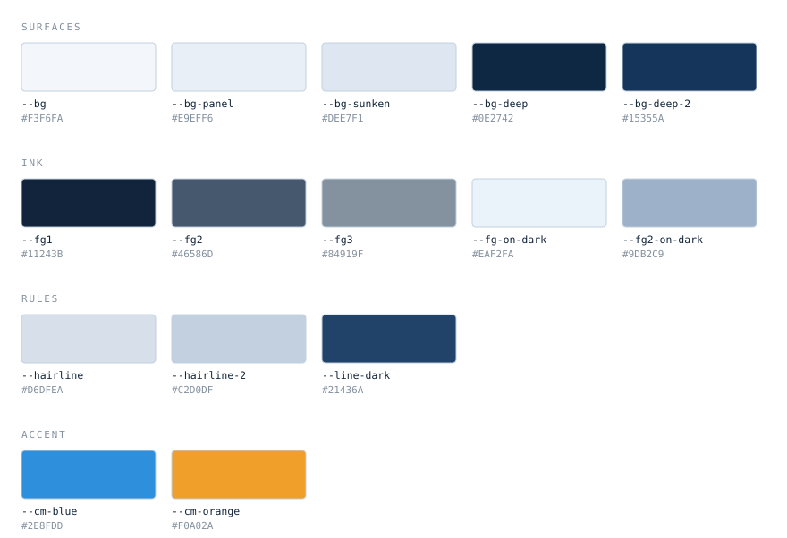
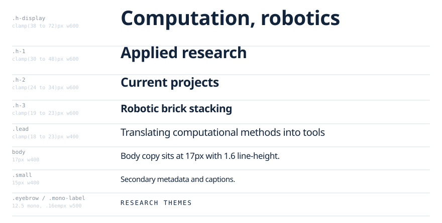
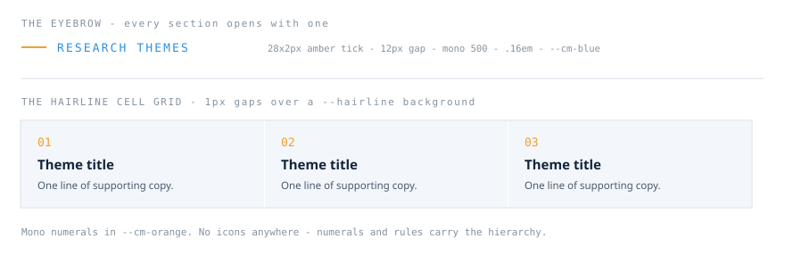
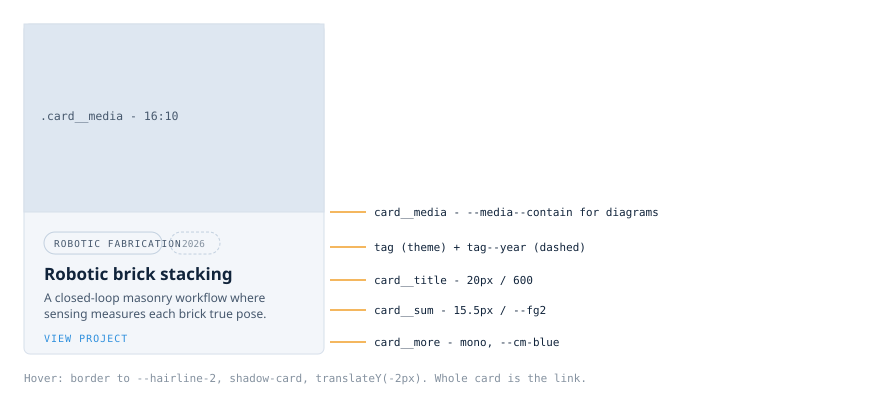
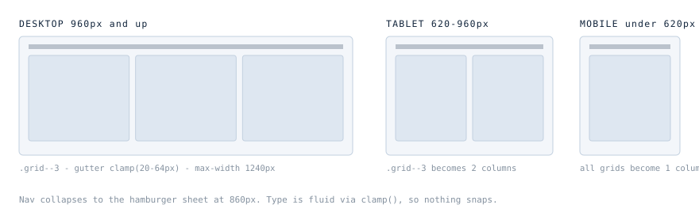

# CM-iTAD Lab — Design Style Reference

The visual system for the CM-iTAD website. Read this before adding a page, a
component, or a colour. The rule of thumb: **if a decision is not described here,
copy the nearest thing that is** rather than inventing a new pattern.

---

## 1. Where this style comes from

Two sources, deliberately kept separate:

| Layer | Source | What it contributes |
|---|---|---|
| **Structure** | Frahan StonePack design system | Type scale, hairline grids, mono eyebrows, squared corners, spec-sheet density |
| **Colour** | CM-iTAD logo | Navy ground, electric blue, amber accent |

StonePack's own palette is warm (limestone / granite / sandstone). We kept its
*structure* and swapped its *colour* for the lab's own. That is why the tokens in
`assets/css/site.css` carry StonePack names (`--hairline`, `--bg-panel`) but
cool values.

The tokens are **inlined** in `site.css`, not imported from the design system, so
the site deploys standalone with no external dependency.

---

## 2. Colour



### Rules

- **One accent per element.** Amber (`--cm-orange`) is for numerals, ticks, and the
  single most important thing on a slide or section. Blue (`--cm-blue`) is for
  eyebrows, links, and interactive affordances. They never compete in the same spot.
- **Amber is never a background for body text.** It appears as 2px ticks, mono
  numerals, and left borders. The one exception is a deliberate emphasis panel.
- **Never introduce a new hex.** If you need an intermediate tone, use an existing
  token. If you genuinely need a new one, add it to `:root` with a comment
  explaining what it is for — do not inline a raw hex in markup.
- **Contrast floor:** body text 4.5:1, headline-scale text 3:1. `--fg3` is for
  captions and metadata only, never for paragraphs.

### Section tone rhythm

Pages alternate tone so bands read as separate thoughts:

```
light  →  light  →  panel  →  deep  →  footer
```

**Maximum one `--section--deep` band per page** (the footer does not count). Two
inverted bands in a row read as a mistake.

---

## 3. Typography



Three families, all IBM Plex, loaded from Google Fonts in `site.css`:

- **`--sans`** (IBM Plex Sans) — everything structural: headings, body, UI.
- **`--mono`** (IBM Plex Mono) — eyebrows, tags, numerals, captions, metadata.
  Mono is the system's "label voice". If text is a label rather than prose, it is mono.
- **`--serif`** (IBM Plex Serif) — available, currently unused. Reserve it for long-form
  essays or a manifesto page if one is ever added.

### Rules

- Headings are **600**, never 700. Letter-spacing is negative (`-.02em`) and tightens
  as size grows.
- All display sizes use `clamp()`. **Never set a fixed px font-size on a heading** —
  it will break the mobile layout.
- Mono labels are uppercase with `.16em` tracking. That tracking is what makes them
  read as labels rather than shouting.
- Body copy caps at `74ch` (`.detail__body`) and lead copy at `62ch`. Long measures
  are the fastest way to make a research site feel unedited.

---

## 4. Signature motifs



### The eyebrow

Every section opens with one. It is the system's most recognisable element:

```html
<p class="eyebrow">Research themes</p>
```

A 28×2px amber tick, 12px gap, mono 500 at `.16em` in `--cm-blue`. On dark bands the
text switches to amber. Do not use an eyebrow twice in the same band.

### The hairline cell grid

The spec-sheet motif inherited from StonePack: a `--hairline` background showing
through 1px gaps between cells.

```html
<div class="cells cells--3">
  <div class="cell">
    <span class="cell__num">01</span>
    <span class="h-3">Theme title</span>
    <span class="card__sum">Supporting copy.</span>
  </div>
</div>
```

Use it for enumerable things — themes, capabilities, collaboration modes. Use
**cards** instead when each item has an image and links somewhere.

### No icons

There are no icons in this system. Mono numerals (`01`, `02`), rules, and type
weight carry the hierarchy. Adding an icon set would fight the spec-sheet character
and is the single easiest way to make the site look generic.

---

## 5. The project card



The card is the most repeated component. It is generated by `projectCard()` in
`app.js` — you should never hand-write one.

- The **whole card is the link**. No nested anchors, no separate "read more" button.
- `card__media` is 16:10 and crops (`object-fit: cover`) for **photographs**.
- Add `fit: "contain"` to an image record for **diagrams, plots and figures** — this
  switches the tile to a white background with padding so nothing is cropped off.
  Every FEM plot, graph-ML figure and workflow diagram must use it.
- Hover raises the card 2px and deepens the border. Motion is 160ms; anything slower
  feels sluggish in a grid.

---

## 6. Layout & responsive behaviour



- Content max-width **1240px**, gutter `clamp(20px, 5vw, 64px)`.
- Grids are `.grid--2`, `.grid--3`, `.grid--4`; they collapse to 2 columns under
  960px and 1 column under 620px. Cell grids behave the same way.
- Navigation collapses into a full-width sheet at **860px**.
- **Never set a fixed pixel width or height on a content box.** Use `aspect-ratio`
  for media and let text boxes size themselves. Fixed heights are what caused the
  overflow bugs in the deck version of this content.
- Minimum tap target on mobile is 44px. `.btn` and `.filter` are already sized for it.

### Spacing

Vertical rhythm comes from three section classes, not from ad-hoc margins:

| Class | Padding block | Use |
|---|---|---|
| `.section` | `clamp(48px, 7vw, 104px)` | Standard content band |
| `.section--tight` | `clamp(34px, 4.5vw, 64px)` | Page headers, stat strips |
| `.section--deep` / `--panel` | as `.section` | Tone changes |

Inside a band, prefer `gap` on a flex/grid parent over margins on children.

---

## 7. Imagery

- **Photographs** are real lab documentation. Never use stock imagery — the
  credibility of a research site rests on the work looking like itself.
- **Figures and plots** go in `contain` tiles on white. Do not crop a plot to fill
  a card; an axis label lost is data lost.
- Every image needs meaningful `alt` text describing *what the research shows*, not
  just what is pictured.
- Animated GIFs are allowed for simulation cycles (the PCM louvre study). They
  autoplay and loop; keep them under ~2MB.

---

## 8. Voice

Matter-of-fact and specific. The pattern that works throughout the existing copy:

> **State the problem plainly → say what the project does → say why that matters.**

- Name the actual method (`TopologicPy CellComplex`, `true 3D finite-element
  analysis`), not a category (`advanced computational techniques`).
- No marketing intensifiers: *cutting-edge*, *revolutionary*, *state-of-the-art*.
- Sentence case for headings. Title Case only for proper nouns.
- British-leaning spelling is used consistently (`optimisation`, `texturization`
  where the source used it) — match the surrounding text rather than switching.

---

## 9. Accessibility checklist

Before shipping any new page:

- [ ] Skip link is present and first in the DOM
- [ ] One `<h1>` per page
- [ ] All images have `alt` (decorative ones `alt=""`)
- [ ] Focus states visible (the global `:focus-visible` rule handles this — do not remove it)
- [ ] Interactive controls are `<button>` or `<a>`, never a styled `<div>`
- [ ] Text contrast ≥ 4.5:1
- [ ] Layout survives 320px width and 200% zoom

---

## 10. Anti-patterns

Things that will make the site stop looking like itself:

| Don't | Why |
|---|---|
| Add an icon set | Fights the numeral/rule hierarchy |
| Use gradients | The system is flat; tone comes from the five surface tokens |
| Introduce a third accent colour | Blue and amber already carry every state |
| Use rounded pills for anything but tags/filters | Radii are 4px and 6px; `--r-pill` is reserved |
| Set fixed heights on text containers | Guarantees overflow at some viewport |
| Write a new card/grid pattern | Extend `projectCard()` instead |
| Put body copy in `--fg3` | Fails contrast; it is a caption tone |
